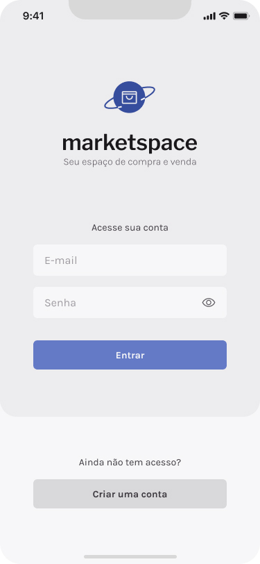

# Ignite-Marketspace

Ignite-Marketspace is a mobile app made using Expo, React Native, and TypeScript. Its purpose is to simulate an e-commerce platform like OLX, Marketplace, or whatever other site. In this app, users can announce products and look at other user advertisers. The app has an authentication system, and the announcer can edit, remove, or disable ads. In the home screen, there is a modal where the user can apply filters or query a specific ad they want.

## Table of Contents

- [Features](#features)
- [Prototype](#prototype)
- [Screenshots](#screenshots)
- [Installation](#installation)
- [Technologies](#technologies)
- [Disclaimer](#disclaimer)

## Features

- E-commerce platform simulation: The app simulates an e-commerce platform where users can announce products and look at other user advertisers.
- Authentication system: The app has an authentication system, allowing users to create an account and sign in to access the features.
- Advertiser control: The announcer can edit, remove, or disable their ad.
- Filtering and querying: The app has a modal on the home screen where users can apply filters or query a specific advertisement they want.
- Local storage: The app uses Async Storage to store data locally.
- Image picker: The app uses Expo Image Picker to allow users to select images for their advertisements.
- Error handling: The app uses various error handling techniques, such as displaying error messages and form validation, to ensure smooth functionality.

## Prototype

Check out the [Figma prototype](https://www.figma.com/file/37dtaJyMXgMRi57cQDVidU/Marketspace-(Copy)?node-id=0-1&t=sMXVd198pE2Jwuvv-0) for this project.

## Screenshots

Here are some screenshots of the project:

    
Click to view images

    <h2>Home</h2>
    
    <h2 style="margin-top: 50px">Login</h2>
    
    <h2 style="margin-top: 50px">User Adds Screen</h2>
    
    <h2 style="margin-top: 50px">Advertise Details</h2>
    
    <h2 style="margin-top: 50px">Create Ad Form</h2>
    
    

## Installation

To get started with IgniteShoesApp, you'll need to have Expo CLI installed on your machine. Once you have it installed, 
you can clone the repository and install the dependencies:

1. git clone this repository
2. Navigate to the api folder and install its dependencies:  
    `cd api`  
    `npm i`

3. Run the backend: `npm run dev`  
    Note: This API uses prisma, so you can run `npx prisma studio` on other terminal to watch database.

4. In another terminal window, navigate to the mobile-app folder and update config.ts with your IPV6 local address:  
    `export const API_BASE_URL = 'http://yourIPV6address:3333';`

5. Build the app `expo build:android` if android or `expo build:ios`. 
6. Once the build process is complete, you will receive a link to download the APK file or iOS build. Download and install the app on your device.
7. Start the development server by running the following command: `expo start`
8. Open the Expo Go app on your mobile device and scan the QR code displayed in the Expo developer tools in your web browser. This will launch the app on your device using a development build.

## Technologies

- Expo
- React Native
- TypeScript
- Axios
- NativeBase
- Yup
- React Hook Form
- Phosphor React Native

## Disclaimer

This project's design and API was provided by [@Rocketseat](https://github.com/Rocketseat) as part of the Ignite course. In this project I developed mobile front-end code.